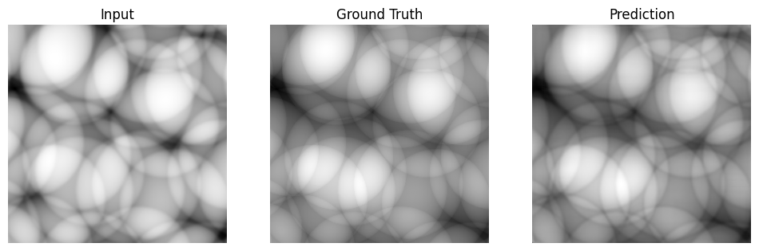
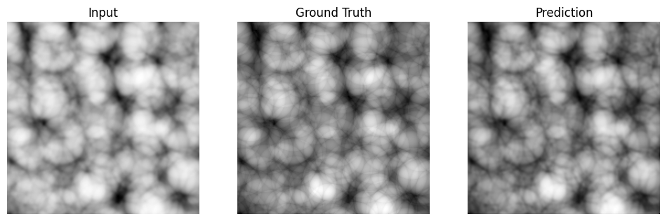
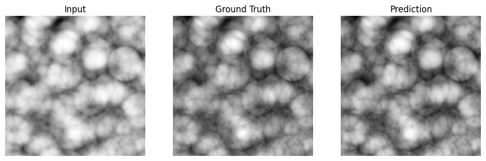
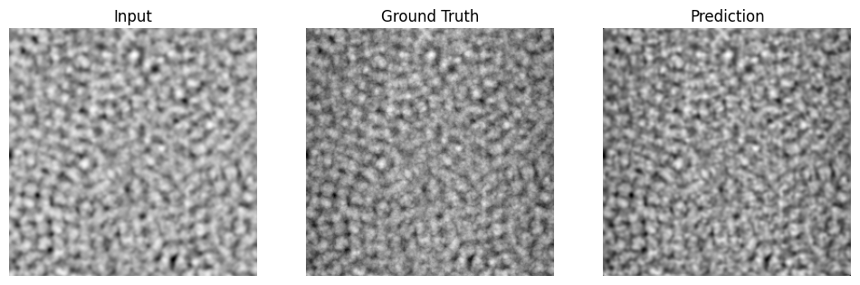

# Image-to-image translation

Learn a mapping from simulated X-ray phase-contrast images to projected-thickness images with PyTorch. This supervised inverse-problem model learns from paired simulations, where conventional reconstruction would typically use multiple measurements and a physical imaging model.

## Visual examples

**Phase contrast → projected thickness**

Each comparison shows the input image on the left, the ground-truth target in the center, and the prediction on the right.



### More examples







*Figures supplied by the project author from prior work. The generating model, checkpoint, data split, and display scales have not been verified, so these examples are illustrative and are not benchmark results for the MCNN implementation in this repository.*

## Setup

Use Python 3.10 or newer:

```sh
python3 -m venv .venv
source .venv/bin/activate
pip install -r requirements.txt
```

## Data

Place the extracted dataset in this layout:

```text
data/dataset/
  phase_contrast/*.tif
  projected_thickness/*.tif
```

Images are paired by the first numeric ID in their filenames. Missing or duplicate IDs are rejected. Both folders must contain matching IDs. Data is not downloaded automatically.

## Train

```sh
python train.py --data-dir data/dataset --epochs 10 --batch-size 4 --plot
```

The script uses matched 256 × 256 center crops, an 80/20 split with seed 42, Adam, and multi-resolution mean-absolute-error (MAE) loss. The default model is MCNN; pass `--model unet` for a single-output baseline using MAE. CUDA is selected when available; otherwise training uses the CPU. Reduce the batch size if memory is limited. Weights, per-epoch metrics (`history.json`), run settings (`config.json`), and the split manifest are saved to `outputs/`. Use `--output-dir` and `--lr` to change the output location and learning rate. `--plot` displays validation examples after training.

## Reference notebook

`notebooks/image_to_image.ipynb` preserves the original code, with saved outputs removed. It contains the original machine-specific data path and repeated training cells; use `train.py` for the portable workflow.

## Scientific considerations

The first numeric filename ID must actually identify the same simulation in both folders. Inspect this before training. The original center-crop and tensor conversion behavior is retained: 8-bit images are scaled to [0, 1], while other TIFF types may retain their native numerical range. Verify dtype and units for your data before comparing losses. Splitting related simulation samples randomly may cause leakage; use a simulation-level split if related images share a source. This baseline does not evaluate full-resolution images or calibrate physical units.

## Validation

The script is syntax-checked. Training requires the dataset and installed dependencies and has not been run in this repository.

## Starting point: Wang et al. (2020)

Wang, F., Eljarrat, A., Müller, J., Henninen, T. R., Erni, R., and Koch, C. *Multi-resolution convolutional neural networks for inverse problems*. Scientific Reports 10, 5730. https://doi.org/10.1038/s41598-020-62484-z

The paper extends a U-Net with coarse decoder predictions to supervise low-frequency target structure at multiple resolutions. Our compact adaptation uses four prediction heads (32, 64, 128, and 256 pixels for a 256-pixel input), area-averaged targets, and an equal-weight mean of the per-scale MAE. Only the finest output is used for prediction. Layer widths, number of scales, target averaging, and loss weighting are implementation choices; this is not an exact reproduction of the published models. The authors' implementation is available at https://github.com/fengwang/MCNN.

Compare MCNN and U-Net using identical data splits and training budgets, with distinct output directories. Validation reports finest-resolution MAE and RMSE separately from the multi-scale training objective. A held-out test set and physical-model comparison are needed before claiming reconstruction accuracy or generalization to measured X-ray images.
